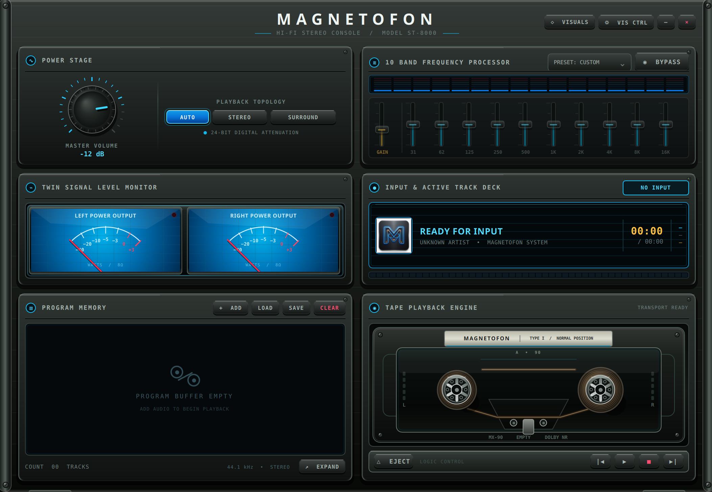

# Magnetofon (ST-8000) — Native C++ Edition

<p align="center">
  
</p>

<h3 align="center">Magnetofon ST-8000 — High-Fidelity Music & Video Console (Native C++ / Qt 6 QML)</h3>

<p align="center">
  Magnetofon is a high-performance desktop music and concert-video console built with <strong>C++17</strong>, <strong>Qt 6 QML (OpenGL Scene Graph)</strong>, and <strong>libmpv</strong>. Styled after high-end McIntosh sapphire blue glass faceplates and Sony ES 3D extruded metallic hardware.
</p>

<p align="center">

  <a href="#key-features">Features</a> •
  <a href="#-interface-showcase">Gallery</a> •
  <a href="#playlist--library-discovery">Library</a> •
  <a href="#installation--build">Setup & Build</a> •
  <a href="#architecture">Architecture</a>
</p>

---

## Overview & Performance Highlights

**Magnetofon ST-8000** combines the physical tactile elegance of vintage 1980s/1990s Japanese and American audiophile component stacks with a **pure C++17 engine**, direct `libmpv` C++ audio pipeline, and hardware-accelerated **Qt Quick OpenGL Scene Graph** rendering.

- **0% CPU Animation Jank**: Powered by Qt Quick Scene Graph GPU rendering, CSS repaints and main-thread webview bottlenecks are completely eliminated.
- **Ultra-Low Memory Footprint (~35 MB RAM)**: Uses ~85% less RAM than webview/Electron applications.
- **Direct `libmpv` C++ Audio Engine**: No IPC bridge overhead. Audio properties, PCM meter physics, equalizer filters, and channel-aware routing run natively in C++.
- **Direct Multichannel PCM Decode**: FLAC, DTS/DTS-HD, Dolby Digital, Dolby Digital Plus, and Dolby TrueHD sources are decoded directly to PCM with native 5.1/7.1 channel layouts preserved whenever the output device supports them.
- **Synchronized Concert Video**: Music videos play in a separate Qt-owned, hardware-accelerated window driven by the same `libmpv` instance as the audio, keeping transport and A/V sync unified.
- **Smart Library Discovery**: Select or drop a music folder to recursively discover supported tracks across nested artist, album, and disc directories with natural ordering and duplicate prevention.
- **Portable Playlist Files**: Load standard `.m3u`/`.m3u8` playlists or save the current queue as a UTF-8 M3U8 playlist with portable relative paths.
- **McIntosh Sapphire Blue VU Meters**: Custom C++ `QQuickPaintedItem` rendering dual-needle power output meters at 60+ FPS with spring physics.
- **Frameless Windowless Console**: Native desktop integration with seamless titlebar window dragging (`startSystemMove()`), minimize, and close controls.

---

## 📸 Interface Showcase

<p align="center">
  
</p>


---

## Key Features

### Hi-Fi Audio Console Modules
- **Power Stage (`AmplifierPanel`)**: Knurled aluminum Master Volume knob centered on dark metallic faceplate with 11-tick cyan scale, plus vertical playback mode buttons (`AUTO`, `STEREO`, `SURROUND`).
- **Twin Signal Level Monitor (`VuMeterPanel`)**: Dual McIntosh cyan blue VU meters rendered on the GPU scene graph with peak warning LEDs.
- **10-Band Frequency Processor (`EqualizerPanel`)**: 16-band real-time spectrum analyzer, EQ preset selector, `POWER: ON / BYPASS` toggle, gain slider, and 10 EQ frequency band sliders.
- **Input & Active Track Deck (`ProgramMonitorPanel`)**: VFD screen displaying album art, track details, source codec/layout, decoded PCM output, selectable container audio tracks, timing information, and a segmented seek bar.
- **Program Memory (`PlaylistPanel`)**: Music and video queue with individual-file loading, recursive folder discovery, file/folder drag-and-drop, duplicate prevention, and M3U/M3U8 playlist persistence.
- **Music Video Window (`VideoWindow`)**: Automatically opens for video media, supports normal window resizing/maximizing, and can be hidden or reopened with the `VIDEO` control without interrupting audio playback.
- **Tape Playback Engine (`CassettePanel`)**: Maxell UR90 tape shell with 4 corner slotted screws, Maxell label block, window guide bands, rotating reels, metallic cassette head assembly, and 3D metallic transport push-buttons.

---

## Supported Media Formats

Magnetofon handles media natively through `libmpv` and FFmpeg:

### Audio

- **Lossless**: FLAC, WAV, AIFF, AIF, ALAC
- **Surround codecs**: DTS, DTS-HD High Resolution, DTS-HD Master Audio, Dolby Digital (AC-3), Dolby Digital Plus (E-AC-3), Dolby TrueHD/MLP, multichannel FLAC, and LPCM
- **Multichannel routing**: Native 5.1/7.1 PCM output in Auto and Surround modes; proper stereo downmix; mono/stereo-to-5.1 upmix in Surround mode
- **Compressed**: MP3, AAC, M4A, OGG, OPUS, WMA, MP2

Compressed surround tracks are decoded to PCM in memory. Magnetofon does not create temporary converted files and does not enable S/PDIF/HDMI compressed bitstream passthrough. TrueHD and DTS-HD MA therefore retain their lossless channel data; AC-3 and standard DTS are reproduced faithfully without another lossy encoding stage.

### Music Video

- **Containers**: MKV, MKA, MP4, M4V, MOV, WebM, M2TS, MTS, TS, VOB, and AVI
- **Video codecs**: Determined by the installed/bundled `libmpv` FFmpeg runtime; tested with H.264, HEVC, MPEG-2, VC-1, and AV1
- **Multiple audio tracks**: The container default is selected initially; alternate mixes, languages, and stereo/surround tracks can be selected from the active-track deck
- **Video output**: Hardware decoding is attempted safely with automatic software fallback. Closing the video window hides the picture while playback continues; the `VIDEO` button restores it.
- **Application lifecycle**: Closing the main console stops playback and terminates the video and visualizer processes cleanly, even when auxiliary windows are open.

---

## Playlist & Library Discovery

The **PROGRAM MEMORY** panel provides four library controls:

- **ADD**: Select one or more individual music or video files.
- **DISCOVER**: Select a folder and recursively add supported media from all nested artist, album, and disc folders.
- **LOAD**: Replace the current queue with a saved `.m3u` or `.m3u8` playlist.
- **SAVE**: Save the current queue as a UTF-8 `.m3u8` playlist. Media paths are stored relative to the playlist file where possible, making playlists portable with their library folder.

Files are naturally ordered by folder and filename, so names such as `Album 2` precede `Album 10` and track `02` precedes track `10`. Existing queue entries are not duplicated. You can also drag individual files or an entire folder directly onto the playlist panel.

Missing and unsupported entries in loaded playlists are skipped without adding broken queue items.

### Visual Preset Library

The bundled curated presets remain in the read-only application resources. The optional full preset pack is downloaded and extracted into Magnetofon's writable per-user application-data directory; administrator privileges are not required. On Linux this is normally beneath `~/.local/share/Magnetofon/`.

---

## Installation & Build

### System Dependencies (Linux / Ubuntu / Debian)

```bash
sudo apt update
sudo apt install build-essential cmake qt6-base-dev qt6-declarative-dev qt6-tools-dev \
  libmpv-dev libpulse-dev libavformat-dev libavcodec-dev libavutil-dev libx11-dev \
  pkg-config unzip
```

### Quick Run

To build and run Magnetofon Native directly from the repository:

```bash
./run.sh
```

`run.sh` performs an incremental CMake configure/build before launching, so local source and QML changes are always reflected in the executable.

### Manual Compilation via CMake

```bash
cmake -S src-cpp -B src-cpp/build -DCMAKE_BUILD_TYPE=Release
cmake --build src-cpp/build --parallel
./src-cpp/build/MagnetofonNative
```

---

## Architecture

```
Magnetofon/
├── run.sh                     (Root launch script)
├── run_native.sh              (Native C++ build launcher)
└── src-cpp/
    ├── CMakeLists.txt         (CMake configuration for Qt 6 & libmpv)
    ├── main.cpp               (QApplication, setlocale, & QML engine startup)
    ├── audio/
    │   ├── AudioPlayer.hpp    (C++ QObject wrapping libmpv with Q_PROPERTY bindings)
    │   ├── AudioPlayer.cpp    (Unified audio/video playback, PCM decode, EQ & routing)
    │   ├── AudioRouting.cpp   (Auto/stereo/surround channel-routing policy)
    │   └── TrackMetadataReader.cpp (FFmpeg audio, video, and container metadata)
    ├── models/
    │   ├── PlaylistModel.hpp  (Track queue, recursive discovery & playlist API)
    │   └── PlaylistModel.cpp  (Metadata loading, natural ordering & M3U8 persistence)
    └── ui/
        ├── VideoWindow.cpp    (Qt-owned native video window embedded with libmpv)
        ├── VuMeterItem.hpp    (Custom QQuickPaintedItem for McIntosh Cyan Dual VU)
        ├── VuMeterItem.cpp    (GPU-rendered McIntosh dual needles)
        ├── qml.qrc            (QML resource bundle)
        └── qml/
            ├── main.qml               (Frameless main window & metallic chassis)
            ├── HifiPanel.qml          (3D Extruded Panel Container)
            ├── HifiButton.qml         (Tactile 3D Metallic Push Button)
            ├── Knob.qml               (Tactile Knurled Master Volume Dial)
            ├── EqSlider.qml           (Vertical EQ Slider)
            ├── AmplifierPanel.qml     (Power Stage Module)
            ├── VuMeterPanel.qml       (Twin Signal Monitor Module)
            ├── EqualizerPanel.qml     (10-Band EQ & Spectrum Analyzer Module)
            ├── ProgramMonitorPanel.qml (VFD Display & Progress Deck Module)
            ├── CassettePanel.qml      (Tape Playback Engine Module)
            ├── CassetteDeck.qml       (Maxell UR90 Cassette Shell & Reels)
            └── PlaylistPanel.qml      (Program Memory Queue Module)
```

---

## License

Magnetofon is licensed under the GPL-3.0 License.
