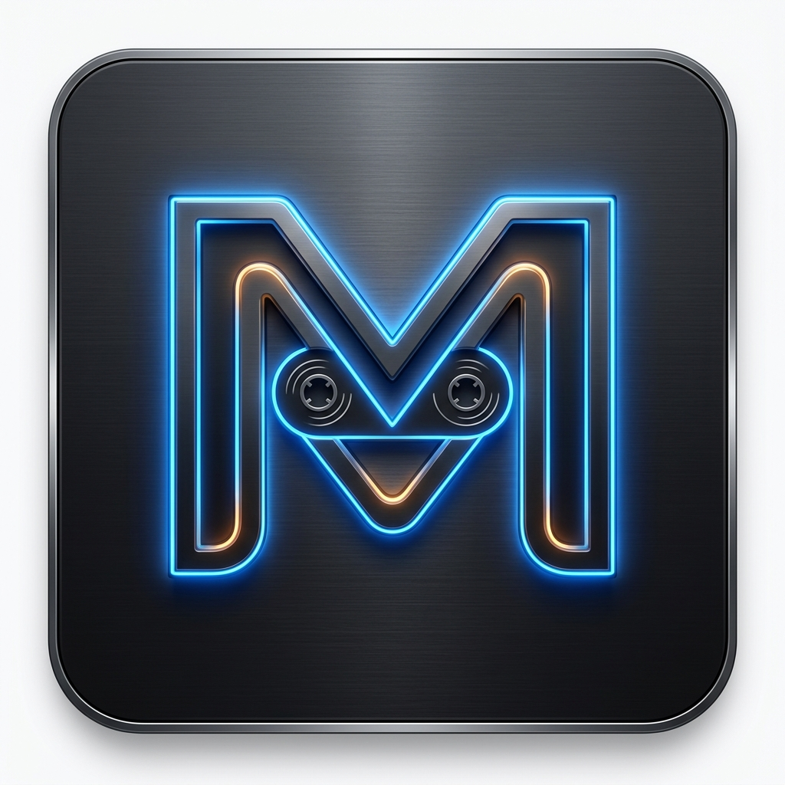

# Magnetofon (ST-8000)

<p align="center">
  
</p>

<h3 align="center">Magnetofon ST-8000 — High-Fidelity Audio Console & Native MilkDrop Visualizer Engine</h3>

<p align="center">
  Magnetofon is a retro-futuristic desktop audio console and native projectM / MilkDrop visualizer engine built with Electron, React, and native OpenGL C++. Styled after high-end McIntosh sapphire blue glass faceplates and Sony ES brushed-metal hardware.
</p>

<p align="center">
  <a href="#-key-features">Features</a> •
  <a href="#-how-to-use">User Guide</a> •
  <a href="#-visuals-engine--music-reactivity">Visualizer Guide</a> •
  <a href="#-installation--setup">Setup & Build</a> •
  <a href="#-architecture">Architecture</a> •
  <a href="#-contributing">Contributing</a>
</p>

---

## Table of Contents

1. [Overview & Design Philosophy](#-overview--design-philosophy)
2. [Key Features](#-key-features)
   - [Hi-Fi Audio Deck & Modules](#hi-fi-audio-deck--modules)
   - [Native projectM 4.2 Visualizer Engine](#native-projectm-42-visualizer-engine)
   - [10-Band Graphic Equalizer & Preamp](#10-band-graphic-equalizer--preamp)
   - [Analog VU Meters & Spectrum Analyzer](#analog-vu-meters--spectrum-analyzer)
   - [Program Memory & Playlist Manager](#program-memory--playlist-manager)
3. [Visuals Engine & Music Reactivity Guide](#-visuals-engine--music-reactivity)
   - [Visuals Control Panel](#visuals-control-panel)
   - [Main vs. Curated Folder Management](#main-vs-curated-folder-management)
   - [Live Keyboard & Mouse Shortcuts](#live-keyboard--mouse-shortcuts)
   - [Live Rating & Curation Workflow](#live-rating--curation-workflow)
4. [Supported Audio Formats & Metadata](#-supported-audio-formats--metadata)
5. [Installation & Setup](#-installation--setup)
6. [Building for Production](#-building-for-production)
7. [Project Architecture](#-project-architecture)
8. [Contributing](#-contributing)
9. [License](#-license)

## Overview & Design Philosophy

**Magnetofon ST-8000** combines the physical tactile elegance of vintage 1980s/1990s Japanese and American audiophile component stacks with a native mpv / FFmpeg (libav) audio engine and C++ OpenGL visual rendering performance.

Key design highlights:

- **McIntosh Sapphire Blue & Warm Amber Illumination**: High-DPI canvas renderings of analog VU meter needles, warm incandescent backlights, and blue acrylic glass panels.
- **Sony ES Brushed Metallic Chassis**: Tactile extruded buttons, knurled volume knobs, 3D recessed slider tracks, and authentic cabinet cheeks with mounting hex screws.
- **Hardware-Accelerated C++ Visualizer**: Embedded `projectMSDL` process running projectM 4.2 with full MilkDrop preset compatibility.

---

## Key Features

### Hi-Fi Audio Deck & Modules

- **Stereo Cassette Deck**: Animated dual cassette reels with real-time tape counter, tape position tracking, and mechanical transport controls (Play, Pause, Stop, Prev, Next, Eject).
- **Master Amplifier Controls**: Knurled aluminum Volume and Balance knobs with LED notch indicators.
- **High-Res Audio Detection**: Automatic detection and badge display for 24-bit/96kHz+ FLAC audio files.

### Native projectM 4.2 Visualizer Engine & Presets Pack

- **Hardware-Accelerated projectM 4.2**: Bundled C++ OpenGL executable (`projectMSDL`) for high-frame-rate rendering.
- **One-Click 9,000+ Curated Preset Pack**: Download and unpack the pre-curated **Isosceles "Cream of the Crop"** MilkDrop preset collection (~137 MB) directly from the `VIS CTRL` panel.
- **Visual Theme & Category Filtering**: Filter visualizer rotation by mood and theme categories (Dancer, Drawing, Fractal, Geometric, Hypnotic, Particles, Reaction, Sparkle, Supernova, Waveform).
- **Preset Folder Management**:
  - **Main Visuals Folder** (`visuals/presets`): Scans the complete 9,000+ preset collection.
  - **Curated Visuals Folder** (`visuals/curated/presets`): Toggle to play your verified favorite presets.
- **Display Timing & Rotation**:
  - Customizable **Preset Duration** (switch interval from 5s to 120s).
  - Customizable **Transition Duration** (0s to 10s smooth crossfade).
  - **Shuffle Mode** vs. Sequential rotation.
  - **Target FPS Selector** (30, 60, 120 FPS).
  - **Fullscreen On Launch** toggle.
- **Music Reactivity Engine**:
  - **Beat Sensitivity (0.0x – 2.0x)**: Adjusts how intensely shaders distort, pulse, zoom, and morph in response to audio rhythm.
  - **Hard Cut Reactivity**: Triggers instant visual scene cuts on heavy bass/drum drops.
  - **Hard Cut Sensitivity (0.0x – 5.0x)** & minimum duration cooldown (1s – 60s).
  - **Audio Device Capture Selector**: Choose system output monitor (PulseAudio / ALSA) or sound card feed.

### 10-Band Graphic Equalizer & Preamp

- **ISO Octave Frequency Bands**: 31Hz, 62Hz, 125Hz, 250Hz, 500Hz, 1kHz, 2kHz, 4kHz, 8kHz, 16kHz (±12dB range).
- **Master Preamp Slider**: ±12dB gain adjustment.
- **EQ Presets**: FLAT, ROCK, POP, CLASSICAL, JAZZ, BASS BOOST.

### Analog VU Meters & Spectrum Analyzer

- **Dual-Needle VU Meter**: High-DPI canvas rendered left and right channel audio peak needles with realistic spring dynamics.
- **16-Bar Spectrum Analyzer**: Real-time 60fps FFT frequency analyzer in McIntosh Sapphire Blue.

### Program Memory & Playlist Manager

- Drag-and-drop file loading & drag-and-drop track reordering.
- Saved playlist manager & M3U playlist file import/export.
- Full keyboard navigation inside playlist rows.

---

## Visuals Engine & Music Reactivity

### Visuals Control Panel

Click **`VIS CTRL`** in the Magnetofon title bar to open the Visuals Control Overlay.

From this panel, you can configure:

- **Visualizer Status**: View running state, launch, stop, or apply & restart `projectM`.
- **Preset Source**: Toggle between **Main Visuals Folder** (`visuals/presets`) and **Curated Visuals Folder** (`visuals/curated/presets`).
- **Timing & Rotation**: Change preset duration, crossfade transition, shuffle mode, and FPS.
- **Music Reactivity**: Adjust beat sensitivity, enable/disable hard cut scene triggers on music peaks, and select audio capture devices.

---

### Live Keyboard & Mouse Shortcuts

When the native `projectM` visualizer window is active, use these native shortcuts directly inside the visualizer window:

| Shortcut                     | Action                                                                     |
| :--------------------------- | :------------------------------------------------------------------------- |
| **`Ctrl + C`**               | Copy full file path of currently playing visual preset to system clipboard |
| **`Spacebar`**               | Lock / Freeze active preset (prevents auto-switching)                      |
| **`N` / `Shift + N`**        | Skip to Next preset (Immediate / Smooth crossfade)                         |
| **`P` / `Shift + P`**        | Skip to Previous preset (Immediate / Smooth crossfade)                     |
| **`R` / `Shift + R`**        | Play Random preset (Immediate / Smooth crossfade)                          |
| **`Y`**                      | Toggle Shuffle Mode                                                        |
| **`Ctrl + F` / Right-Click** | Toggle Fullscreen / Open native projectM overlay menu & preset picker      |

---

### Live Rating & Curation Workflow

#### Method A: Live Liking via Clipboard (Recommended)

1. While listening to music with the projectM visualizer open, when a visual catches your eye, press **`Ctrl + C`** in the visualizer window.
2. Open the **`VIS CTRL`** panel in Magnetofon and click **`LIKE PLAYING PRESET FROM CLIPBOARD (Ctrl+C)`**.
3. Click **`MOVE LIKED PRESETS TO CURATED FOLDER`** to automatically bundle the `.milk` preset and its textures into `visuals/curated/presets`.

#### Method B: Interactive Preset Rating List

1. Open **`VIS CTRL`** panel and scroll to **`PRESET RATING & CURATION MANAGER`**.
2. Search presets in the search bar and click the **Heart** icon next to any preset.
3. Click **`MOVE LIKED PRESETS TO CURATED FOLDER`**.

---

## Supported Audio Formats & Metadata

| Format        | Codec / Container         | High-Res Support                 |
| :------------ | :------------------------ | :------------------------------- |
| **FLAC**      | Free Lossless Audio Codec | ✅ 16-bit, 24-bit / up to 192kHz |
| **MP3**       | MPEG Layer 3 (CBR/VBR)    | ✅ Up to 320kbps                 |
| **WAV**       | Uncompressed PCM          | ✅ 16-bit, 24-bit PCM            |
| **OGG**       | Ogg Vorbis                | ✅ Standard Vorbis streams       |
| **M4A / AAC** | Advanced Audio Coding     | ✅ AAC-LC / HE-AAC               |

### Metadata Extraction

Magnetofon automatically parses ID3, Vorbis Comments, and MP4 tags using `music-metadata`:

- Title, Artist, Album, Year, Track Number, Duration, Bitrate, Sample Rate, Bits per Sample.
- Embedded album artwork with automated fallback scanning for `cover.jpg`, `folder.jpg`, `album.png`, etc. in the track directory.

---

## Installation & Setup

### Prerequisites

- **Node.js**: v18.0.0 or higher
- **npm**: v9.0.0 or higher
- **Linux Environment**: Requires PulseAudio / PipeWire (`pactl`) and OpenGL for native projectM playback.

### Installation

```bash
# Clone the repository
git clone https://github.com/magnetofon/Magnetofon.git
cd Magnetofon

# Install Node dependencies
npm install
```

### Development Mode

```bash
# Launch Electron dev server with hot reload
npm run dev
```

---

## Building for Production

```bash
# Compile renderer and main process
npm run build

# Build Linux package (AppImage, deb, snap)
npm run build:linux

# Build for Windows
npm run build:win

# Build for macOS
npm run build:mac
```

The output binaries will be placed in the `dist/` directory.

---

## Project Architecture

```
Magnetofon/
├── resources/
│   └── projectm/          # Bundled projectM 4.2 native executable & C++ libraries
├── visuals/
│   ├── presets/           # Main Visuals Folder (Full preset library)
│   ├── textures/          # Main Textures Folder
│   └── curated/           # Curated Visuals Folder (Verified favorites)
├── src/
│   ├── main/              # Electron Main Process
│   │   └── index.js       # Window manager, projectM spawner, IPC handlers, protocol handlers
│   ├── preload/           # Electron Preload Bridge
│   │   └── index.js       # ContextBridge safe API exports (`window.api`)
│   └── renderer/          # React 19 Frontend
│       └── src/
│           ├── components/# HifiSystem, EqualizerWindow, PlaylistWindow, etc.
│           ├── audio/     # Audio Engine & native mpv bridge
│           ├── store/     # Zustand player state store
│           └── assets/    # McIntosh styling tokens (`hifi.css`), graphics & icons
├── electron.vite.config.mjs
└── package.json
```

---

## Contributing

Contributions are welcome! Whether you are adding MilkDrop presets, refining audio DSP filters, or polishing UI elements:

1. **Fork the Repository**.
2. **Create a Feature Branch**: `git checkout -b feature/amazing-feature`.
3. **Commit your changes**: `git commit -m 'Add amazing feature'`.
4. **Push to the branch**: `git push origin feature/amazing-feature`.
5. **Open a Pull Request**.

---

## 🙏 Acknowledgements & Credits

- **[projectM Visualizer Engine](https://github.com/projectM-visualizer/projectm)**: Open-source cross-platform MilkDrop visualizer engine.
- **[Cream of the Crop MilkDrop Presets Collection](https://github.com/projectM-visualizer/presets-cream-of-the-crop)**: The 9,000+ pre-curated MilkDrop preset archive curated by Isosceles and the projectM community.

---

## 📄 License

This project is licensed under the **GPL-3.0 License** — see the [LICENSE](LICENSE) file for details.

`projectM` visualizer engine is licensed under the GNU General Public License v3.0.
