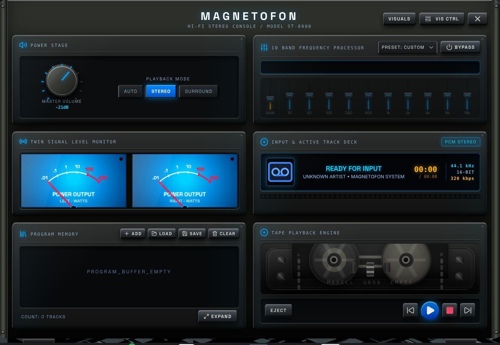
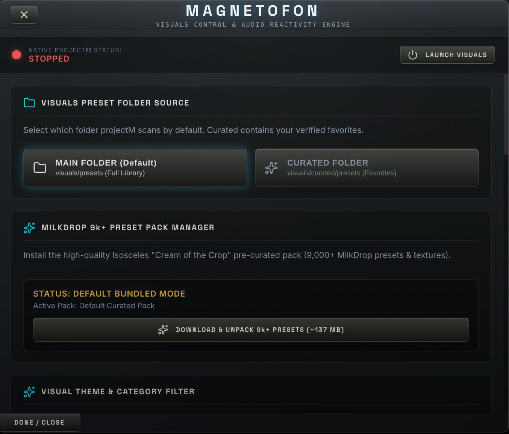
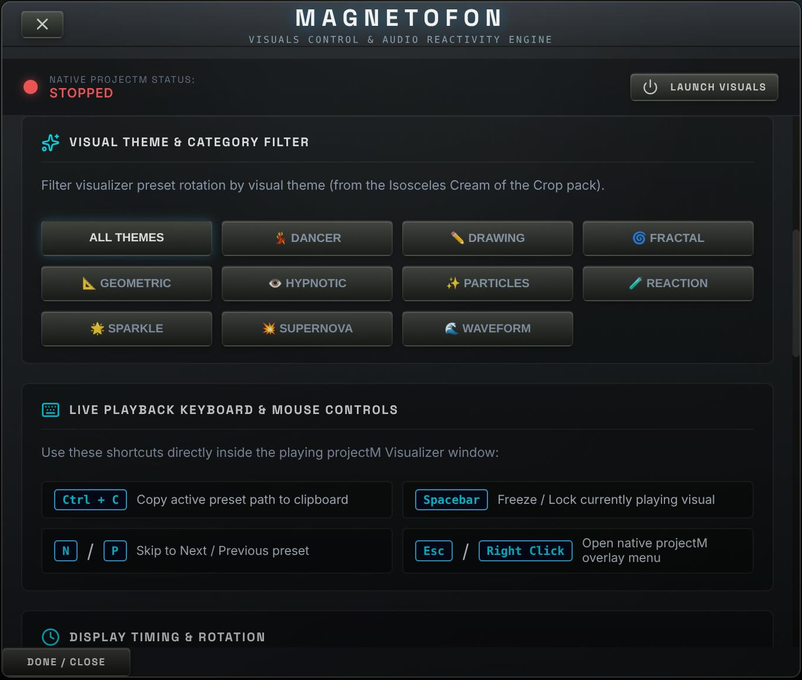
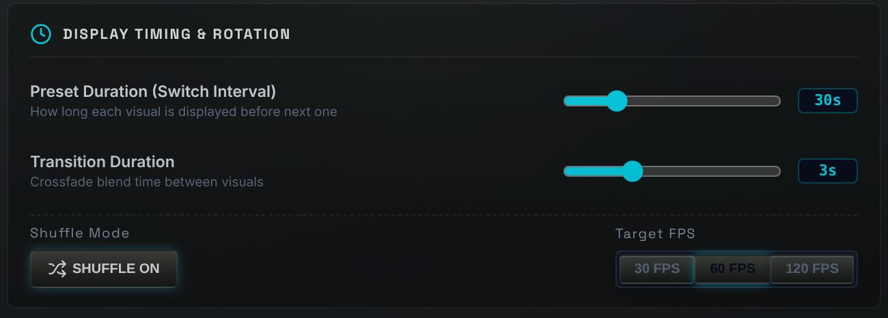
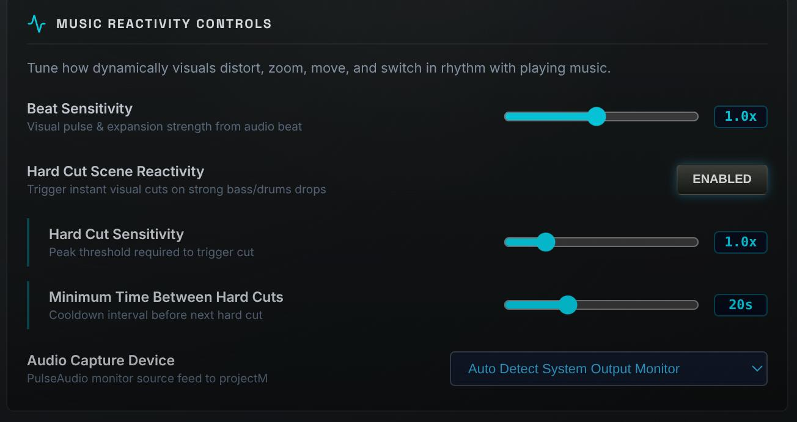
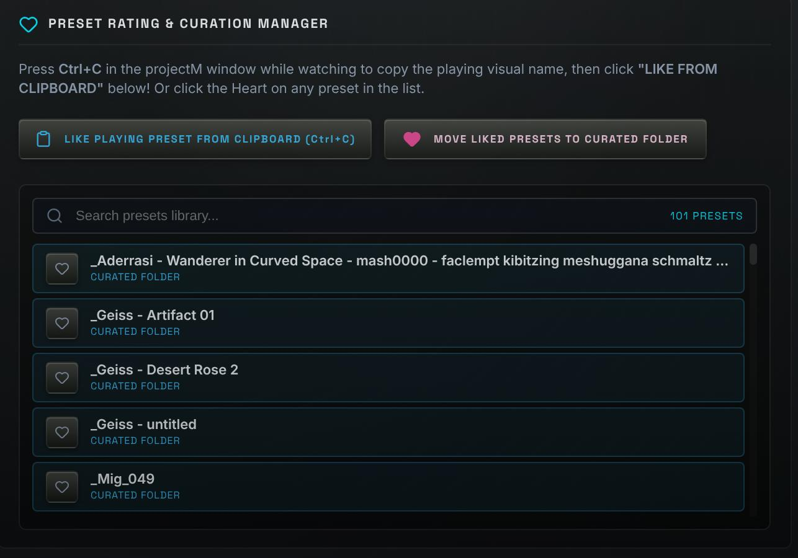

# Magnetofon (ST-8000)

<p align="center">
  
</p>

<h3 align="center">Magnetofon ST-8000 — High-Fidelity Audio Console & Native MilkDrop Visualizer Engine</h3>

<p align="center">
  Magnetofon is an ultra-lightweight retro-futuristic desktop audio console and native projectM / MilkDrop visualizer engine built with <strong>Tauri v2 (Rust)</strong>, React, and native OpenGL C++. Styled after high-end McIntosh sapphire blue glass faceplates and Sony ES brushed-metal hardware.
</p>

<p align="center">
  
</p>

<p align="center">
  <a href="#-key-features">Features</a> •
  <a href="#-interface-showcase">Gallery</a> •
  <a href="#-how-to-use">User Guide</a> •
  <a href="#-visuals-engine--music-reactivity">Visualizer Guide</a> •
  <a href="#-installation--setup">Setup & Build</a> •
  <a href="#-architecture">Architecture</a> •
  <a href="#-contributing">Contributing</a>
</p>

---

## Table of Contents

1. [Overview & Design Philosophy](#-overview--design-philosophy)
2. [📸 Interface Showcase](#-interface-showcase)
3. [Key Features](#-key-features)
   - [Hi-Fi Audio Deck & Modules](#hi-fi-audio-deck--modules)
   - [Native projectM 4.2 Visualizer Engine](#native-projectm-42-visualizer-engine)
   - [10-Band Graphic Equalizer & Preamp](#10-band-graphic-equalizer--preamp)
   - [Analog VU Meters & Spectrum Analyzer](#analog-vu-meters--spectrum-analyzer)
   - [Program Memory & Playlist Manager](#program-memory--playlist-manager)
4. [Visuals Engine & Music Reactivity Guide](#-visuals-engine--music-reactivity)
   - [Visuals Control Panel](#visuals-control-panel)
   - [Main vs. Curated Folder Management](#main-vs-curated-folder-management)
   - [Live Keyboard & Mouse Shortcuts](#live-keyboard--mouse-shortcuts)
   - [Live Rating & Curation Workflow](#live-rating--curation-workflow)
5. [Supported Audio Formats & Metadata](#-supported-audio-formats--metadata)
6. [Installation & Setup](#-installation--setup)
7. [Building for Production](#-building-for-production)
8. [Project Architecture](#-project-architecture)
9. [Contributing](#-contributing)
10. [License](#-license)

---

## Overview & Design Philosophy

**Magnetofon ST-8000** combines the physical tactile elegance of vintage 1980s/1990s Japanese and American audiophile component stacks with an ultra-lightweight **Tauri v2 (Rust)** engine, native mpv / FFmpeg (libav) audio backend, and C++ OpenGL visual rendering performance.

Key design & performance highlights:

- **Ultra-Low Memory Footprint (~35 MB RAM)**: Powered by Tauri v2 and native OS webview rendering (WebKit/WebView2), Magnetofon uses ~84% less RAM than typical Electron desktop apps.
- **Compact Package Size (19 MB Executable)**: Lightning-fast startup time (<300ms) with lightweight native binaries.
- **McIntosh Sapphire Blue & Warm Amber Illumination**: High-DPI canvas renderings of analog VU meter needles, warm incandescent backlights, and blue acrylic glass panels.
- **Sony ES Brushed Metallic Chassis**: Tactile extruded buttons, knurled volume knobs, 3D recessed slider tracks, and authentic cabinet cheeks with mounting hex screws.
- **Hardware-Accelerated C++ Visualizer**: Embedded `projectMSDL` process running projectM 4.2 with full MilkDrop preset compatibility.

---

## 📸 Interface Showcase

<p align="center">
  
</p>
<p align="center">
  
</p>
<p align="center">
  
</p>
<p align="center">
  
</p>
<p align="center">
  
</p>
<p align="center">
  
</p>

---

## Key Features

### Hi-Fi Audio Deck & Modules

- **Stereo Cassette Deck**: Animated dual cassette reels with real-time tape counter, tape position tracking, and mechanical transport controls (Play, Pause, Stop, Prev, Next, Eject).
- **Master Amplifier Controls**: Knurled aluminum Volume and Balance knobs with LED notch indicators.
- **High-Res Audio Detection**: Automatic detection and badge display for 24-bit/96kHz+ FLAC audio files.

### Native projectM 4.2 Visualizer Engine & Presets Pack

- **MilkDrop Preset Pack Manager**: One-click download & extraction of the 138 MB pre-curated **Isosceles "Cream of the Crop"** pack (9,000+ MilkDrop presets).
- **Visual Theme Categories**: Filter visuals by theme (_Fractal, Dancer, Geometric, Hypnotic, Particles, Reaction, Sparkle, Supernova, Waveform_).
- **Embedded C++ OpenGL Visualizer**: Native `projectMSDL` process running projectM 4.2 with hardware-accelerated rendering.

---

## Installation & Setup

### Prerequisites

- **Node.js**: v18.0.0 or higher
- **npm**: v9.0.0 or higher
- **Rust Toolchain**: v1.75.0 or higher (`rustc`, `cargo`)
- **Linux Environment**: Requires webkit2gtk-4.1 (`libwebkit2gtk-4.1-dev`), PulseAudio / PipeWire (`pactl`), and OpenGL.

### Installation

```bash
# Clone the repository
git clone https://github.com/magnetofon/Magnetofon.git
cd Magnetofon

# Install Node dependencies
npm install
```

### Development Mode

```bash
# Launch Tauri v2 dev environment with hot reload
npm run dev:tauri
```

---

## Building for Production

```bash
# Compile frontend assets
npm run build

# Build Tauri v2 production bundle (Linux AppImage & deb / Windows installer)
npm run build:tauri
```

The output binaries will be placed in the `src-tauri/target/release/bundle/` directory.

---

## Project Architecture

```
Magnetofon/
├── src-tauri/             # Tauri v2 Rust Backend
│   ├── src/
│   │   ├── main.rs        # Tauri binary entry point
│   │   ├── lib.rs         # Tauri plugin & app runner setup
│   │   └── commands.rs    # Rust IPC handlers (projectM spawner, preset manager, window docking)
│   ├── Cargo.toml         # Rust crate dependencies (tauri v2, reqwest, zip, tokio)
│   └── tauri.conf.json    # Window configs, app metadata & bundle rules
├── resources/
│   └── projectm/          # Bundled projectM 4.2 native executable & C++ libraries
├── visuals/
│   ├── presets/           # Main Visuals Folder (Full preset library)
│   ├── textures/          # Main Textures Folder
│   └── curated/           # Curated Visuals Folder (Verified favorites)
├── src/
│   └── renderer/          # React 19 Frontend
│       └── src/
│           ├── api/       # tauriBridge.js (Tauri IPC mapping layer)
│           ├── components/# HifiSystem, EqualizerWindow, PlaylistWindow, etc.
│           ├── audio/     # Audio Engine & native mpv bridge
│           ├── store/     # Zustand player state store
│           └── assets/    # McIntosh styling tokens (`hifi.css`), graphics & icons
└── package.json
```

---

## 🙏 Acknowledgements & Credits

- **[projectM Visualizer Engine](https://github.com/projectM-visualizer/projectm)**: Open-source cross-platform MilkDrop visualizer engine.
- **[Cream of the Crop MilkDrop Presets Collection](https://github.com/projectM-visualizer/presets-cream-of-the-crop)**: The 9,000+ pre-curated MilkDrop preset archive curated by Isosceles and the projectM community.
- **[Tauri Framework](https://tauri.app/)**: Ultra-lightweight native application framework for Rust and Web frontend.

---

## 📄 License

This project is licensed under the **GPL-3.0 License** — see the [LICENSE](LICENSE) file for details.
